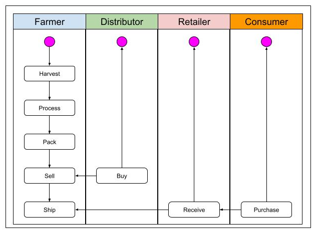
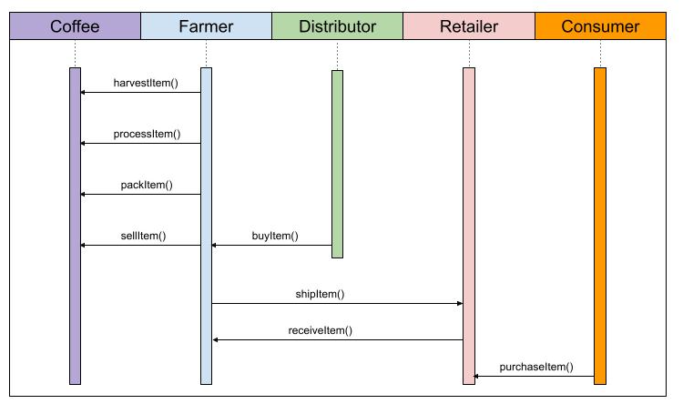
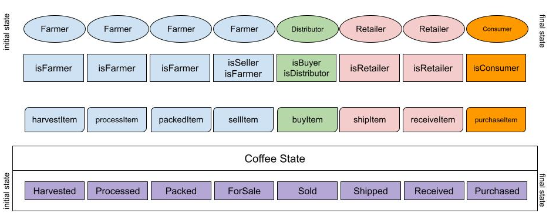

# Part 1: Plan the project with write-ups
## Requirement 1 - UML

### Activity Diagram



### Sequence Diagram



### State Diagram



## Requirement 2 - Libraries

* Truffle v5.1.0 (core: 5.1.0) - to compile, deploy and testing Smart Contracts
* Solidity v0.5.12 (solc-js)
* Node v11.12.0
* Web3.js v1.2.2 - client-side library that can be used alongside a web page and query and can submit transactions to Ethereum nodes
* Truffle Hdwallet-provider - provider that will connect our web3 to the Ethereum world
* Infura - to deploy the contract on the Sepolia public test network


## Requirement 3 - IPFS
N/A

# Part 4: Deploy smart contracts on public test network

### Contract Hash
FarmerRole - 0x481c3881cdafa6947eb6329453002168a6a69a260ecfd5b752e2da700fceeb77

DistributorRole - 0x83f2eafbed6e559683f8e376834b2579df9f16e14232ac2edbd3bde19758f939

RetailerRole - 0xf51c7421177558d8e202e715aa7c215e8e57bf0ae8d3f3dcb5bd30e9b9ab10ef

ConsumerRole - 0x0509a42d39dd178faaeb779316178b83773ca63414a0562a3c94d16f4677af6d

SupplyChain - 0x3786e7d49af79c8e034389bffef04e2130c158f6102a91cf9f24dc102245d4a4


### Contract Address
FarmerRole - 0x1E3eb6b7f8D169A456E5D4BDB4af889C699ECc26

DistributorRole - 0xD6A27b44B76e94740e5fE5FD36518b3540ff4e66

RetailerRole - 0xbc267E163E8190Fe06DE9dE08EEce36A01C925a4

ConsumerRole - 0x2090e0e9F14E250eFCdc6Da63567e3d6818f14f4

SupplyChain - 0xA100c14C2B8c6066c6924FAC9545d4EF5B2217c4


### Prerequisites

Please make sure you've already installed ganache-cli, Truffle and enabled MetaMask extension in your browser.

```
Give examples (to be clarified)
```

### Installing

> The starter code is written for **Solidity v0.4.24**. At the time of writing, the current Truffle v5 comes with Solidity v0.5 that requires function *mutability* and *visibility* to be specified (please refer to Solidity [documentation](https://docs.soliditylang.org/en/v0.5.0/050-breaking-changes.html) for more details). To use this starter code, please run `npm i -g truffle@4.1.14` to install Truffle v4 with Solidity v0.4.24. 

A step by step series of examples that tell you have to get a development env running

Clone this repository:

```
git clone https://github.com/udacity/nd1309/tree/master/course-5/project-6
```

Change directory to ```project-6``` folder and install all requisite npm packages (as listed in ```package.json```):

```
cd project-6
npm install
```

Launch Ganache:

```
ganache-cli -m "spirit supply whale amount human item harsh scare congress discover talent hamster"
```

Your terminal should look something like this:


In a separate terminal window, Compile smart contracts:

```
truffle compile
```

Your terminal should look something like this:


This will create the smart contract artifacts in folder ```build\contracts```.

Migrate smart contracts to the locally running blockchain, ganache-cli:

```
truffle migrate
```

Your terminal should look something like this:


Test smart contracts:

```
truffle test
```

All 10 tests should pass.


In a separate terminal window, launch the DApp:

```
npm run dev
```

## Built With

* [Ethereum](https://www.ethereum.org/) - Ethereum is a decentralized platform that runs smart contracts
* [IPFS](https://ipfs.io/) - IPFS is the Distributed Web | A peer-to-peer hypermedia protocol
to make the web faster, safer, and more open.
* [Truffle Framework](http://truffleframework.com/) - Truffle is the most popular development framework for Ethereum with a mission to make your life a whole lot easier.


## Authors

See also the list of [contributors](https://github.com/your/project/contributors.md) who participated in this project.

## Acknowledgments

* Solidity
* Ganache-cli
* Truffle
* IPFS
